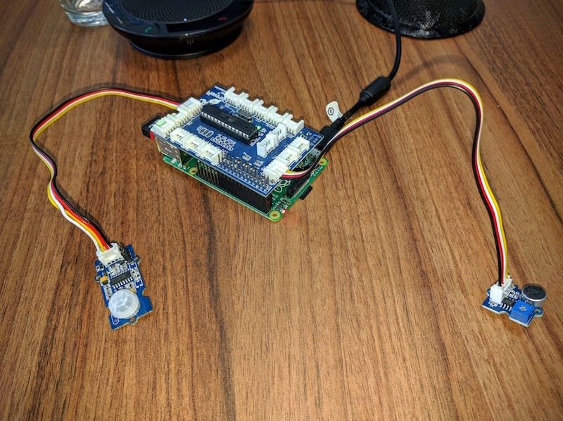
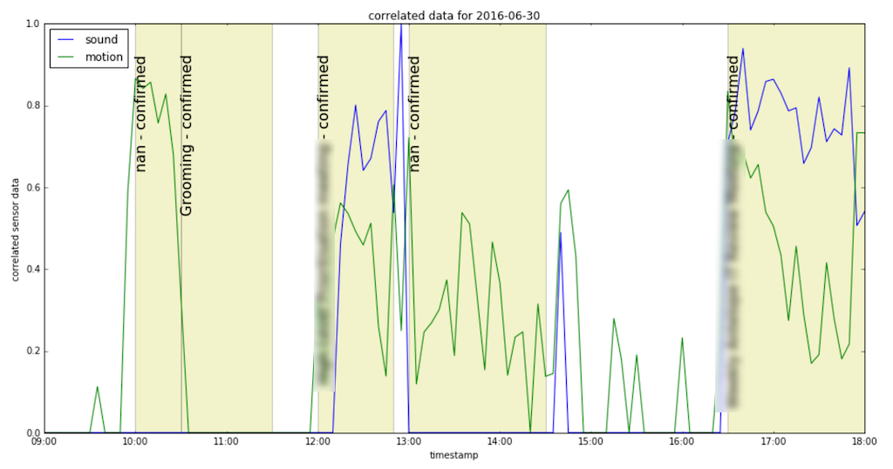

# raspberrypi-room-monitor
RaspberryPi + GrovePi which monitors motion/sound in a conference room and compares with Google Calendar

It consists of 3 modules:
* RaspberryPi with GrovePi sensors - gathers metrics from sound and motion sensors and uploads them to Google Cloud Storage bucket,
* Google Calendar API exporter - Google Apps script which snapshots data from Calendar API for particular day and conf room to Google Cloud Storage bucket,
* Python scripts - which compares calendar and sensor data and outputs stats/charts.

## RaspberryPi with GrovePi sensors

Hardware consists of:
* [Raspberry Model B+](https://www.raspberrypi.org/products/model-b-plus/) running [Raspbian for Robots](http://www.dexterindustries.com/raspberry-pi-robot-software/) OS,
* [GrovePi](http://www.dexterindustries.com/grovepi/),
* [Grove PIR Motion Sensor](http://www.seeedstudio.com/wiki/Grove_-_PIR_Motion_Sensor),
* [Grove Sound Sensor](http://www.seeedstudio.com/wiki/Grove_-_Sound_Sensor),
* 8GB SD Card + Charger + USB WiFi Adapter.

Raspberry is running Python script which gathers data from sensors every second and logs them to file. 
Log files are rotated every 5 minutes and then uploaded to Google Cloud Storage. 

Code is stored in `raspberrypi-monitor` directory. It contains Ansible playbook for configuring and deploying code to RaspberryPi.

More info about Raspberry setup you can find in [raspberrypi-monitor](raspberrypi-monitor) subdirectory.

## Google Calendar API exporter

[Google Apps script](https://developers.google.com/apps-script/) is stored in `apps-scripts`.
It snapshots data from Google Calendar for particular conf room every 5 minutes using [triggers](https://developers.google.com/apps-script/guides/triggers/installable#time-driven_triggers). Scripts run on Google's servers.

Calendar data is dumped every few minutes to find cases when meeting is postponed (as Google Calendar don't store event history).
It's using [OAuth2 library](https://script.google.com/macros/library/versions/d/1B7FSrk5Zi6L1rSxxTDgDEUsPzlukDsi4KGuTMorsTQHhGBzBkMun4iDF) in version 18.

## Python scripts

Code is stored in `scripts` directory. Currently they contain [Jupyter Notebook](http://jupyter.org/) files (`.ipynb` extension) using mainly [Pandas](http://pandas.pydata.org/) for data analysis.

Example chart below shows data for single day:

